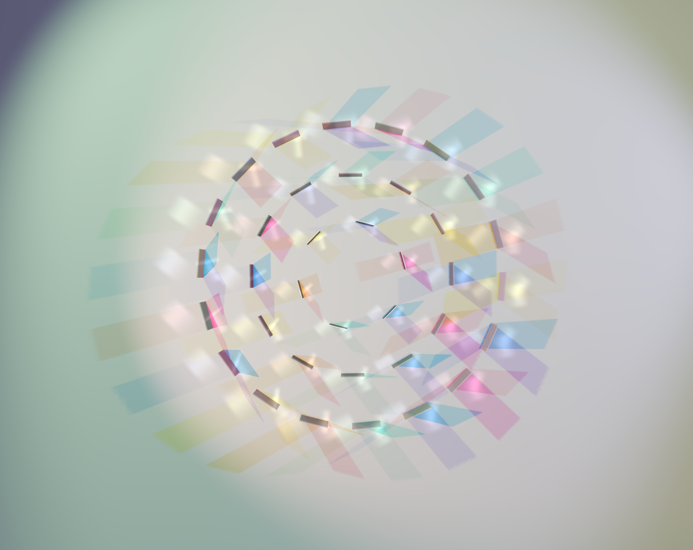
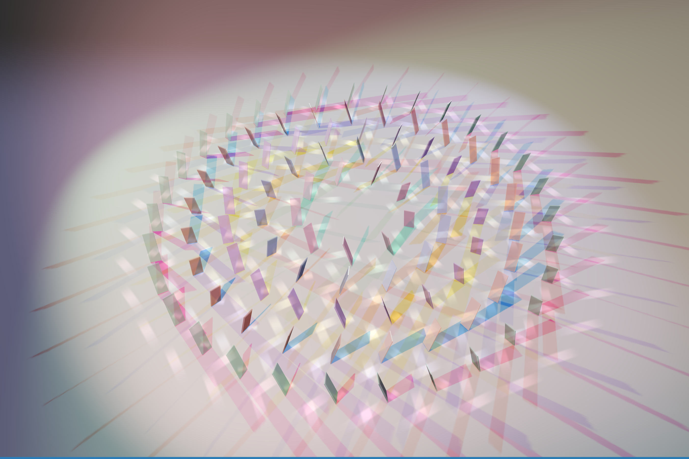
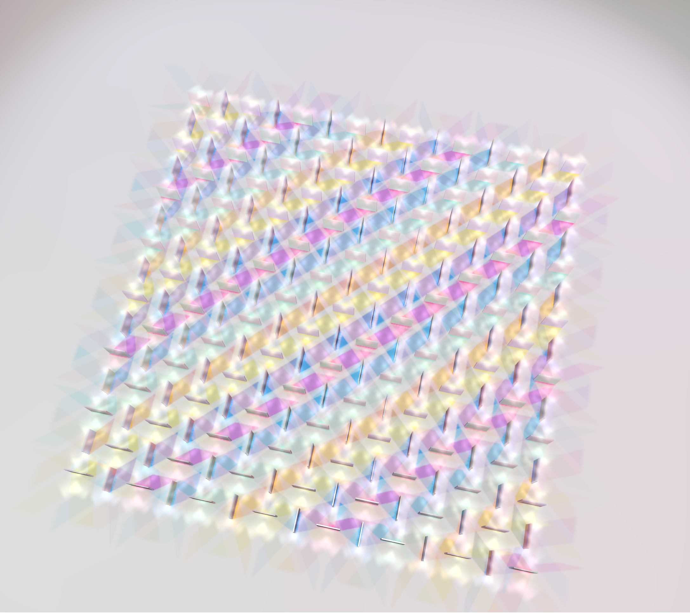

# Dichroic Glass

**A meditative little browser playground where you build sculptures from rainbow-tinted glass and watch them throw colored shadows across the floor.**

> [Open the demo →](https://austinjiangh.github.io/dichroic-glass/)

<p align="center">
  <video src="docs/recording1.mp4" height="320" autoplay loop muted playsinline></video>
  <video src="docs/recording2.mp4" height="320" autoplay loop muted playsinline></video>
</p>

<p align="center">
  
  
  
</p>

The Dichroic Glass Interactive Playground is an innovative, real-time digital simulator that brings the complex optical properties of physical dichroic glass to the web browser. Built entirely on vanilla Three.js without heavy external frameworks, this creative coding project functions as both an interactive art installation and a real-time shader experiment. Users can manipulate lighting parameters, change object positions, and instantly observe how color-shifting materials reflect and transmit light across a 3D canvas.

Inspired by Chris Wood's quiet, gallery-scale installations of dichroic glass, this is a Three.js sandbox where light passes through panes of colored glass and paints the world behind them. Pick a layout. Drag the camera. Tweak the lights. Hit Play and let the camera drift overhead while the lights breathe — the floor turns into a slow, shifting carpet of hue.

## What to play with

When the demo loads, the controls are in two places:

- **Bottom-left** — your two big buttons. Pick a **layout** (Stone Henge, InterWeave, or Turbo) and hit **Play** to start the cinematic auto-orbit.
- **Top-right** — the fiddly knobs. Open *Scene*, *Colored Lights*, *Glass Panels*, *Shadow Tints*, and *Shadows* to dial in your own mood. Save your favorite settings as JSON from the *Settings* folder and reload them later.

Try this:
1. Switch to **Turbo** and press Play. Watch the radial blades catch light from three different angles.
2. Open **Colored Lights** and drag a light's height down to 1 — see how the shadow stretches across the floor.
3. Crank **shadow saturation** in the Scene folder to push the colors from "pastel watercolor" toward "stained glass cathedral".
4. Drop **transmission** on the Glass Panels to make the glass look more solid and the reflections pop.

Drag with your mouse to look around. Scroll to zoom. Hit Pause to take over.

## Run it locally

```bash
pnpm install
pnpm dev
```

Then open http://localhost:5173/.

You'll need [Node.js](https://nodejs.org/) and [pnpm](https://pnpm.io/) installed.

## Acknowledgements

- **[Chris Wood](https://www.chriswoodglass.co.uk/)** — for the original installations that inspired this entire thing. Go look at his work, it's better than anything on a screen.
- **[Colossal](https://www.thisiscolossal.com/2014/09/geometric-dichroic-glass-installations-by-chris-wood/)** — for first pointing me to it.
- **[Three.js](https://threejs.org/)** — the engine doing all the real work.
- **[lil-gui](https://lil-gui.georgealways.com/)** — the controls panel.
- The Three.js forum and community blogs whose posts helped me figure out cookie projections, transmission limitations, and how to actually fake all this in real time.

Built with Claude Code as a thinking partner.

## License

[MIT](LICENSE). Use it, fork it, remix it. Send me a screenshot if you make something beautiful.
